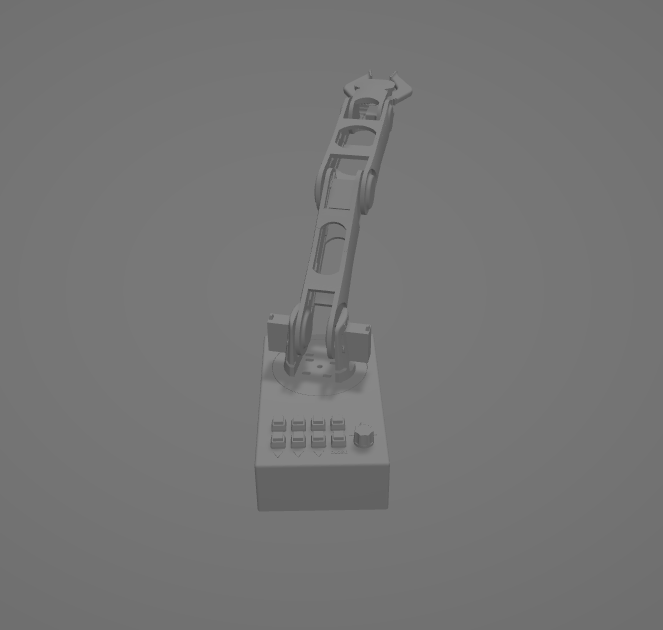

# 3D Printed Robotic Arm
`This project was created on January 2016.`

## Abstract 
Our goal is to reduce the barrier to entry for the field of robotics and make it exponentially more accessible for people around the world. Although the design is not perfect, overall the work is useful in successfully building a robotic arm that is programmed with ease.

## Prerequisites 

#### Arduino Uno
The Arduino Uno is an open-source microcontroller board based on the Microchip ATmega328P microcontroller.

#### 3D printer
A machine allowing the creation of a physical object from a three-dimensional digital model, typically by laying down many thin layers of a material in succession.

#### 4 Standard servos, 2 Micro servos, 8 push buttons

## The circuit board

## The Robotic Arm
The 3D model of the robotic arm can be found on the file `full_assem.stl`

## Authors

*  [**Georgios Angelopoulos**](https://www.linkedin.com/in/george-angelopoulos/)

*  [**Angelos Chatzimparmpas**](https://www.linkedin.com/in/angelos-chatzimparmpas/)

*  [**Georgios Kalampokis**](https://www.linkedin.com/in/george-kalampokis-130875b5/)

## Acknowledgments

 The project was inspired by [Beaconsfield's robotic arm](https://www.instructables.com/3D-Printed-Robot-Arm).
